# Assembly

## Frame

#### 1. Assemble Frame with rods

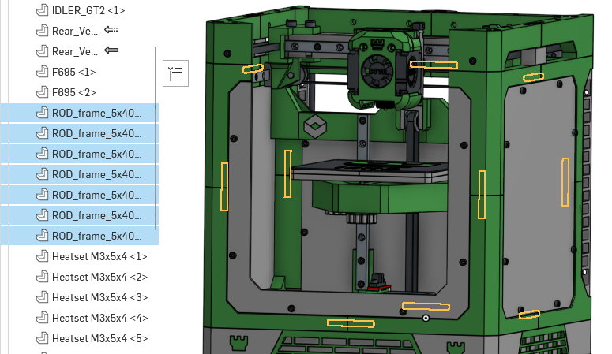

#### 2. Secure together with panels

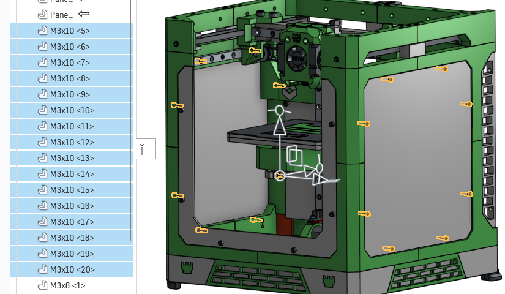

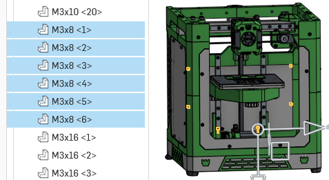

## Skirts and Back air vents

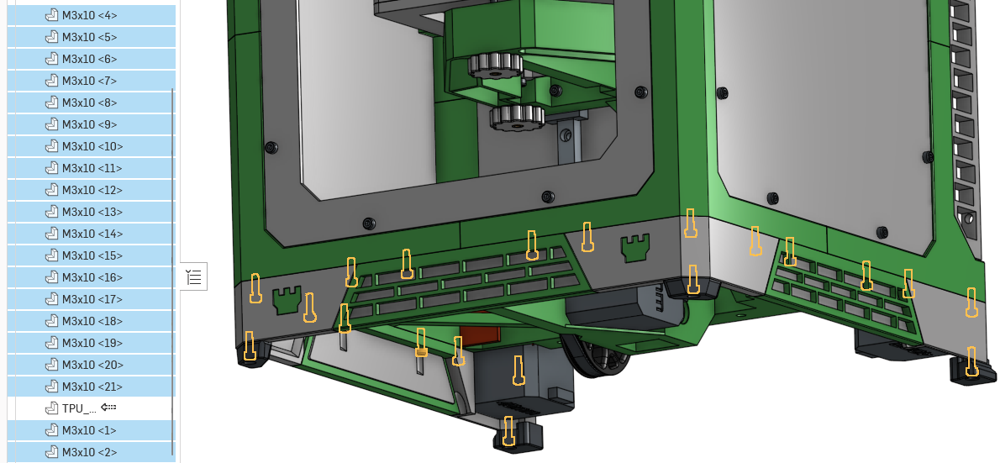

#### Back air vents

todo (not in cad)

## Z Axis

#### 1. Add pulleys and rod

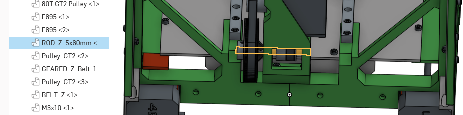

#### 2. add motor and endstop

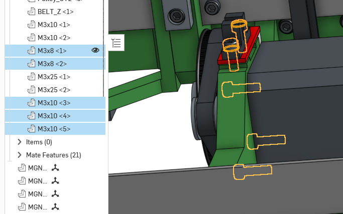

#### 3. Insert into frame

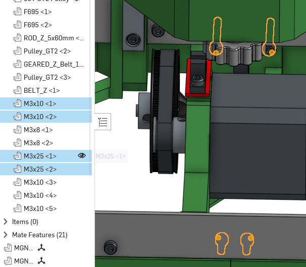

## Rails

#### 1. Attach rails to sides

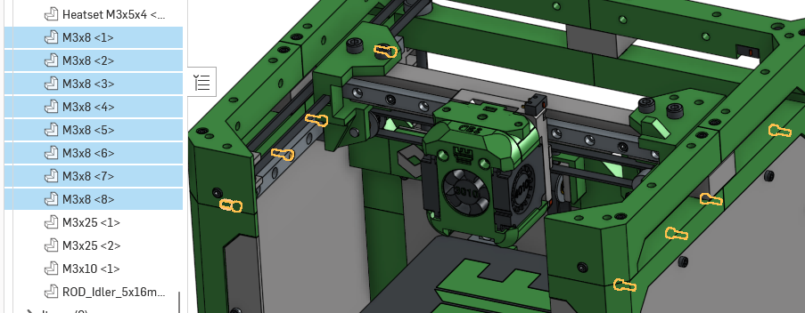

#### 2. Attach rail and sides to gantry

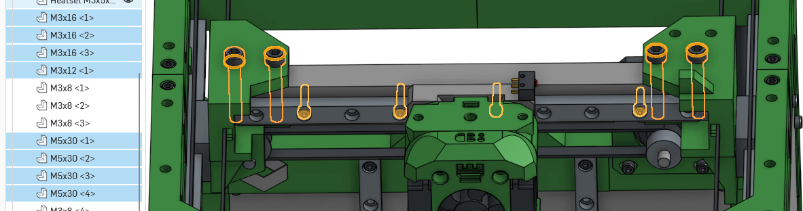

#### 3. Attach z rails

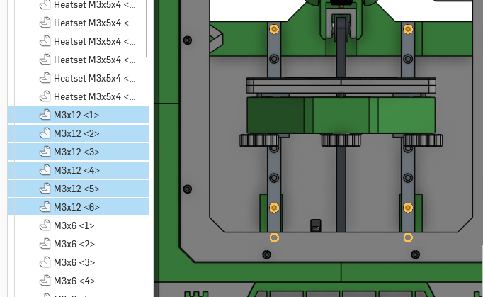

## Gantry

#### mount gantry to rails

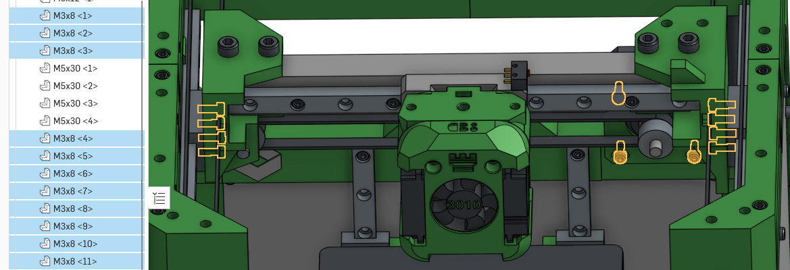

#### Add pin pulley and motors to gantry

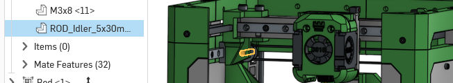

#### Add the rest of the pins and pulleys

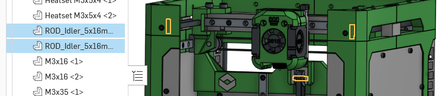

## Bed

#### mount bed holder to rails (also attach endstop bar)

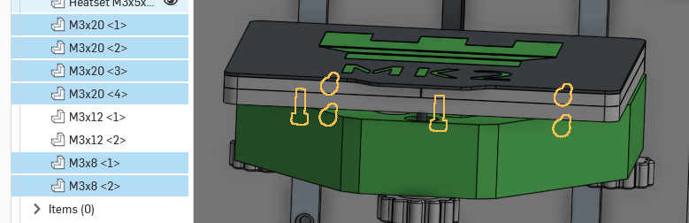

#### insert springs and mount bed to holder

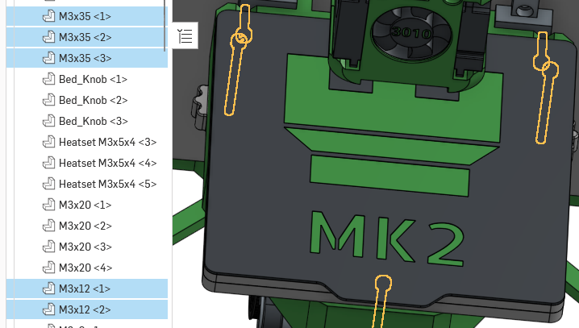
