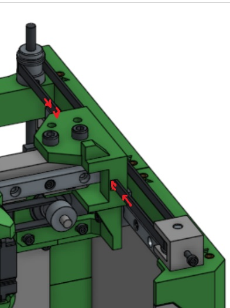

# Belts

The Rook MK2 uses **Cartesian motion** with belts and **apex clips** to move the print head and build platform. Proper belt installation is essential for accurate and smooth motion. All belts attach using apex clips, which lock the belt in place without requiring screws.

!!! Note
    This guide applies to all axes (Both X, Y, and Z). The belt installation method is the same for each.

1. **Route the belt** around the motor pulley, idler, and guide as shown in the frame diagram.
    
3. **Attach the belt using apex clip to one side**:
    * Insert the belt end fully into the provide hole, making sure the teeth align properly to the hole.
    * Insert the apex clip on the oposite side.
    * Press firmly until the clip clicks into place.
4. **Route the belt through the pulley tensioner and to the other side**:
    * Make sure tensioner pulley if fully extended so you can later pull the tension tight.
    * Insert belt fully into the opposite hole making sure the teeth are oriented correctly.
    * Finally insert the apex clip securing the belt. 
    * This allows you to adjust the belt tension later after fully assembled.
5. **Check basic movement**:
    * Move the axis manually to ensure the belt runs smoothly and does not slip.
6. **Adjust tension once assembly is complete**:
    * Use the screw to adjust the slide tensioner and fine-tune the belt tension until there is no slack but the motion remains smooth.

!!! Tip
       * Align belt teeth carefully with pulleys to prevent skipping.
       * **Avoid over-tightening**; excessive tension can damage motors or pulleys.
       * Double-check all axes for smooth, free movement before final calibration.
