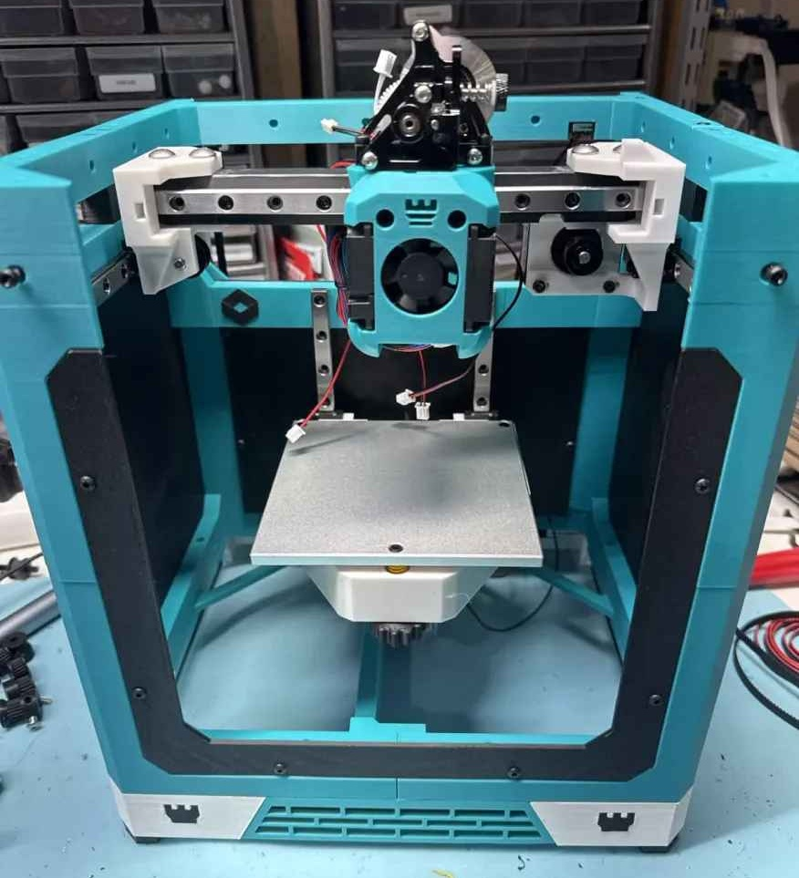

# **John's 2026 ROOK MK2**    

!!! caution "Welcome..."
    These are my modificaitions of [Rolohauns Rook MK2 3D printer!](https://www.printables.com/model/1644597-rook-mk2/files). If you want the official version visit that link.

## Specifications

* 120 x120mm Build Area
* 4:1 Gear Reduction Z
* Cartesian Motion for simplicity
* Fully 3D printed Frame
* Dragonburner Toolhead with wide extruder and hotend support
* Sensorless and Endstop homing support

!!! info "This is my documentation. There are many like it, but this one is mine."

    My documentation is my best friend. It is my life. I must master it as I must master my printer.

    Without my printer, my documentation is useless. Without my documentation, my printer is useless. I must explain every part clearly. I must illustrate better than the confusion that threatens to jam my extruder. I must guide the build before frustration sets in.

    I will show every step. I will label every screw, rod, and pulley. I will document every wire, sensor, and motor. I will include images, notes, and tips that prevent mistakes.

    I am the master of my documentation. I am the guardian of clarity. I am the protector of the build.

    My documentation, with me, is powerful. It will instruct. It will prevent errors. It will save hours of trial and frustration. I will keep it up to date. I will keep it precise. I will keep it accessible.

    I will never leave a step ambiguous. I will never skip a warning. I will always maintain it.

    This is my documentation. There are many like it, but this one is mine.

## TABLE OF CONTENTS

Please select a section to continue:

* [Introduction](intro.md)
* [Bill of Materials](bom.md)
* [Printed Parts](parts.md)
* [Assembly](assembly.md)
* [Belts](belts.md)
* [Wiring & Electronics](wiring.md)
* [Software](software.md)

## Warning

!!! warning "Early Release"
    This is Version 0 of this manual. The printer is not finished and neither is this.