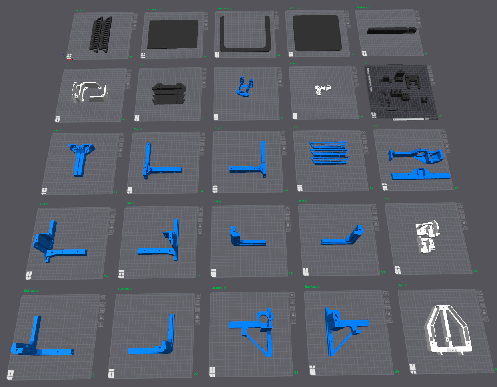

# Parts

!!! Info 
    This printer was designed so it could be printed with PLA and no heated bed, although I have not tested this. YMMV

The following table is to help guide your decision making filament type choice. I have printed my Rooks with parts in various filaments.

| Property |  Scale Factor     | Shrinkage   | Strength   | Impact Resistance | Hardness / Rigidity      | Abrasion Resistance | Heat Resistance | UV Resistance | Aging Resistance | Printability          | Biocompatibility                    | Cost        |
| :------- | :---------------- | :---------- | :--------- | :---------------- | :----------------------- | :------------------ | :-------------- | :------------ | :--------------- | :-------------------- | :---------------------------------- | :---------- |
| ASA      |  100.50%          | 0.4% – 0.7% | ~50–55 MPa | High              | High (Shore D ~70)       | Good                | ~90–100c        | Excellent     | High             | Moderate (enclosure)  | Limited                             | Medium-High |
| ABS      |  100.81%          | 0.7% – 1.6% | ~40–50     | Medium-High       | Medium-High              | Moderate            | ~85–100c        | Poor          | Low              | Moderate (enclosure)  | No                                  | Low-Medium  |
| PETG     |  100.40%          | 0.2% – 1%   | ~50–60     | High              | Medium                   | Moderate            | ~75–85c         | Poor          | Medium           | Easy                  | Limited                             | Medium      |
| PLA      |  100.30%          | 0.2% – 0.5% | ~45–60     | Low-Medium        | High, but brittle        | Poor                | ~60c            | Poor          | Low              | Very Easy             | Yes (food-safe grades)              | Low         |
| Nylon    | ~100.80%–101.20%  | 1.0% – 2.0% | ~60–80     | Very High         | Medium (flexible, tough) | Excellent           | ~100–120c       | Poor          | Medium-High      | Difficult (enclosure) | Limited (some medical grades exist) | Medium-High |

**For best results use a Material type of ABS, ASA.**

The density relates to how heavy the product will be when printed. 

!!! Note "Nylon (PA)" 
    Includes multiple variants such as PA6 (stronger, more hygroscopic), PA12 (easier to print, lower moisture absorption), and filled types like carbon fiber (CF) and glass fiber (GF). Filled nylons have significantly reduced shrinkage and higher rigidity, making them better for structural parts, but are more brittle and abrasive to nozzles. All nylons are hygroscopic and require thorough drying before printing. I do not suggest Nylon due to the difficulties printing.

### Shrinkage

Use this [shrinkage calculator](https://go.minimal3dp.com/calc/shrinkage) to calibrate your printer and filament before printing.

#### Further reading

* 3D4Create (2024) [3D Printer Shrinkage: A Complete Guide](https://3d4create.com/pla-abs-nylon-petg-shrinkage-compensation-essential-facts/)
* Filament2Print (2023) [Shrinkage in 3D Printing: Everything You Need to Know](https://filament2print.com/en/blog/warping-contractions-impression-3d)
* All3DP (2023) [ASA vs ABS: Material Properties and Printing Characteristics](https://all3dp.com/2/asa-vs-abs-differences/)
* 3dsourced (2023) [PLA, ABS, and PETG Shrinkage: Everything You Need To Know](https://www.3dsourced.com/guides/3d-print-shrinkage-pla-abs-petg/)
* 3dprinteddecor (2026) [Stop using the wrong slicer](https://3dprinteddecor.com/bambu-studio-vs-orca-slicer/)

## Print Settings

Verify the following settings:

* **0.20mm Strength@BBL X1C** _Bambu_
* **0.20mm Standard @some printer**

**Quality->Layer Height**

| **Setting**                 | Value                     |
| :-------------------------- | :------------------------ |
| Layer Height                | 0.2mm                     |

**Quality->Line width**

| **Setting**                 | Value                     |
| :-------------------------- | :------------------------ |
| Default                     | 0.42mm                    |

**Quality->Advanced**

| **Setting**                 | Value                     |
| :-------------------------- | :------------------------ |
| Order of walls              | Inner/Outer/Inner         |
| Only one wall on first layer | Check                    |

**Strength->Walls**

| **Setting**                 | Value                     |
| :-------------------------- | :------------------------ |
| Wall loops                  | 4                         |
| Embedding the wall into infill | Checked                |

**Strength->Sparse infill**

| **Setting**                 | Value                     |
| :-------------------------- | :------------------------ |
| **Sparse infill density**   | 40%                       |
| **Sparse infill pattern**   | Locked zag, gyroid, cubic |

**Strength->Top/bottom shells**

| **Setting**                 | Value                     |
| :-------------------------- | :------------------------ |
| Bottom shell layers         | 5                         |

**Speed->Other layers speed**

This will keep the color consistent

| **Setting**                 | Value                     |
| :-------------------------- | :------------------------ |
| Outer wall                  | 50mm/s                    |

## Printing

When you layout the parts I suggest printing only one part at a time. That way if it the room is too cold and the parts curl up you are not wasting a lot of filament.

If you are having problems with lifting edges I suggest the following settings under **Others->Bed adhesion**.

| **Setting**                 | Value                     |
| :-------------------------- | :------------------------ |
| **Skirt Loops**             | 1                         |
| **Skirt type**              | Per object                |
| **Skirt distance**          | 5mm                       |
| **Skirt Height**            | 50                        |
| **Brim type**               | Outer brim Only           |
| **Draft shield**            | Disabled (its too much)   |
| **Brim type**               | Outer Brim only           |
| **Brim Width**              | 5mm (default)             |
| **Brim-Object gap**         | 0.1mm (default)           |

This will create a mini draft shield that should keep the corners from curling unless your workspace is really cold.

## Extra Parts

If you don't want to buy pins, couplers, idlers and pulleys and rails you can print them. I printed them as place holders on my build until my parts came in. I have not had a chance to determine the longevity of these parts, although I doubt the rails will be sufficient for any use other than observation.

* [Rails](https://www.printables.com/model/338778-mgn9c-rail-and-carriage/files)
* [Couplers](https://www.printables.com/model/1370729-coupler-5mm-to-5mm-shaft)
* [Pulleys](https://www.thingiverse.com/thing:1430558)
* [Idlers](https://www.printables.com/model/1100977-pulleys-gt2-20t-for-a-6mm-belt-and-a-5-mm-shaftbol)
* Pins (link coming soon) - Print horizontal with ASA and you can not break them.

## Customization

You can down load different inserts to customize your Rook.

* [Hexmod](https://www.printables.com/model/1673426-rook-2026-mk2-hexmod)
* [Vanitymod](https://www.printables.com/model/1682095-rook-2026-mk2-vanity-mod)

